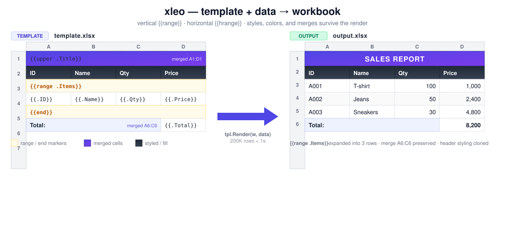

# xleo
A Go library for rendering dynamic Excel templates (template `.xlsx` + data → complete `.xlsx`).
Supports variable substitution inside cells, **vertical** loops (rows), **horizontal** loops
(columns), nested loops, outer-context access, and built-in helper functions.
Rendering goes through excelize's `StreamWriter` for high throughput and low memory use.

<p align="center">
  
</p>

**Performance:** 200,000 rows × 5 columns (including `time.Time`) in **under 1 second** on an
i7-1255U laptop (verified by `TestPerfTarget`).

## Install

```bash
go get github.com/ndmt1at21/xleo
```

## Quickstart

```go
package main

import (
    "log"

    "github.com/ndmt1at21/xleo"
)

func main() {
    tpl, err := xleo.ParseFile("template.xlsx")
    if err != nil {
        log.Fatal(err)
    }
    data := map[string]any{
        "Title": "Report",
        "Items": []map[string]any{
            {"ID": "A1", "Name": "Shirt", "Qty": 10},
            {"ID": "B2", "Name": "Pen", "Qty": 25},
        },
        "Total": 35,
    }
    if err := tpl.RenderToFile("output.xlsx", data); err != nil {
        log.Fatal(err)
    }
}
```

A sample template:

| A | B | C |
|---|---|---|
| `{{.Title}}` | | |
| `ID` | `Name` | `Qty` |
| `{{range .Items}}` | | |
| `{{.ID}}` | `{{.Name}}` | `{{.Qty}}` |
| `{{end}}` | | |
| `Total:` | | `{{.Total}}` |

## Template syntax

### Variables inside cells

- `{{.Field}}` — read a field/key from the current context (the loop item, or the root when
  outside any loop).
- `{{.User.Email}}` — drill down with dotted paths.
- `{{.}}` — the current item itself (useful when iterating a slice of primitives).
- `{{$}}` — the root context (the data originally passed to `Render`).
- `{{$.Currency}}` — a path rooted at `$`; useful inside a loop to reach outer fields.
- Mixed literal + expression in the same cell:
  `"Hello {{.Name}}, you have {{.Count}} orders"` (result is a concatenated string).

When a cell contains a **single** expression, the original value type is preserved
(int / float / bool / `time.Time`), so numeric and date cells keep their proper Excel type.

### Vertical loops — `{{range .Items}} ... {{end}}`

Each marker must be the **only content of its cell** and the **only marker on that row**.
Every row between `range` and `end` is repeated for each element of the slice.

```
A1: {{range .Items}}
A2: {{.ID}}    B2: {{.Name}}    C2: {{.Qty}}
A3: {{end}}
```

Nesting is supported:

```
{{range .Groups}}
  Group: {{.Name}}
  {{range .Items}}
    - {{.}}
  {{end}}
{{end}}
```

### Horizontal loops — `{{hrange .Cols}} ... {{hend}}`

Place `hrange` and `hend` markers on the same row. The cells **between** them form the
template that gets expanded column-by-column for each element.

```
A1: Item    B1: {{hrange .Months}}    C1: {{.}}    D1: {{hend}}
A2: Sales   B2: {{hrange .Values}}    C2: {{.}}    D2: {{hend}}
```

With `Months = ["Jan", "Feb", "Mar"]`, row 1 becomes: `Item | Jan | Feb | Mar`.

### Built-in variables & functions

Beyond paths, a cell may contain a **function call** in the form `{{funcName arg1 arg2 ...}}`,
where each `arg` is either a path (`.Foo`, `$.X`), a quoted string (`"..."`), or a number
(`123`, `4.5`).

**Context variables** (no arguments):

| Name | Returns |
|------|---------|
| `{{currentRow}}` | The current output row number (1-based, after range expansion) |
| `{{currentCol}}` | The current output column number (1-based, after hrange expansion) |
| `{{colName}}` | The current column letter (`A`, `B`, ..., `AA`) |
| `{{index}}` | 0-based index of the innermost `range` loop |
| `{{index1}}` | 1-based index of the innermost `range` loop |
| `{{rowNum}}` | Alias for `currentRow` |
| `{{now}}` | `time.Time` at render time |

**Time helpers** (timestamps in seconds / milliseconds since Unix epoch):

```
{{unixTime .ts}}                                      // "2026-05-22 00:00:00" (UTC, default layout)
{{unixTime .ts "Asia/Ho_Chi_Minh"}}                   // shift to +07
{{unixTime .ts "Asia/Ho_Chi_Minh" "02/01/2006 15:04"}}
{{unixMillis .ts_ms "Asia/Tokyo" "2006-01-02"}}
{{formatTime .startedAt "UTC" "Mon, 02 Jan 2006"}}    // for an existing time.Time
```

`tz` accepts any IANA timezone name (e.g. `Asia/Ho_Chi_Minh`, `America/New_York`).
`layout` is a Go reference layout (`2006-01-02 15:04:05`). Both have sensible defaults.

**String / numeric helpers:**

```
{{upper .name}}                  // "ABC"
{{lower .name}}                  // "abc"
{{concat .first " " .last}}      // concatenate any number of args
{{default .name "Anonymous"}}    // fallback when empty / zero / nil
{{sprintf "%05d" .id}}           // fmt.Sprintf-style formatting
{{add .a .b}}  {{sub .a .b}}  {{mul .a .b}}  {{div .a .b}}
```

`add/sub/mul` return an int when both operands are ints; `div` always returns `float64`.

**Registering custom functions** (call *before* `ParseFile`):

```go
xleo.RegisterFunc("vnd", func(args []any) (any, error) {
    n, _ := args[0].(int)
    return fmt.Sprintf("%d ₫", n), nil
})
// In the template: {{vnd .price}}
```

### Data input

`data` can be:

- `map[string]any` (recommended — fastest, no reflection per access).
- `struct` or `*struct` (field access via reflect).
- Any slice / array inside `range` / `hrange`.

## API

```go
type Template struct{ /* ... */ }

func ParseFile(path string) (*Template, error)
func ParseBytes(data []byte) (*Template, error)

func (t *Template) Render(w io.Writer, data any) error
func (t *Template) RenderToFile(path string, data any) error

func RegisterFunc(name string, fn func(args []any) (any, error)) error
```

A `Template` is safe to **reuse** across many renders with different data (parse once,
render many times).

## Performance

Rendering uses `excelize.StreamWriter`, which streams XLSX output instead of keeping the
whole workbook in memory:

| Rows    | Time     | Transient memory | Output size |
|---------|----------|------------------|-------------|
| 10,000  | ~ 45 ms  | ~ 16 MB          | ~ 240 KB    |
| 50,000  | ~ 210 ms | ~ 90 MB          | ~ 1.2 MB    |
| 200,000 | ~ 600 ms | ~ 230 MB         | ~ 4.7 MB    |

(Measured on i7-1255U; results vary per machine — run `go test -bench=. -benchmem` locally.)

Applied optimizations:
- Templates are parsed once into an AST; subsequent renders skip parsing.
- Per-row buffers (cell list, values slice, string builder) are reused (less GC pressure).
- Fast path for `map[string]any` data (no reflection on field access).
- Original value types are preserved (int/float/time) — numbers are never quoted as strings.

## Styles, column widths, merged cells

- **Cell styles:** every style defined in the template (font, color, fill, border,
  number format, alignment) is cloned onto the output workbook so cells keep
  their original appearance.
- **Column widths:** preserved from the template.
- **Merged cells:**
  - Merges entirely outside any `range`/`hrange` are re-applied at their original
    position.
  - Merges entirely inside a range body (between `{{range}}` and `{{end}}`) are
    re-applied **once per iteration**, shifted to the output row offset of that
    iteration. This is what you want for "header row that spans columns" or
    multi-row card-style layouts repeated for each item.
  - A merge that partially overlaps a loop boundary is skipped (place merges
    either fully inside or fully outside a loop).

## Limitations (current release)

- Expressions are paths (`.A.B.C`, `$.X`) or function calls — no operators, conditionals,
  or pipelines yet.
- `hrange` does not yet nest inside another `hrange` on the same row.
- Excel formulas in template cells are treated as plain values — cell references inside
  formulas are not rewritten when rows expand.

## Run tests & benchmarks

```bash
go test ./...                                       # unit tests
go test -run TestPerfTarget                         # performance acceptance (200K < 1s)
go test -bench=. -benchmem -run=^$ -benchtime=3x    # detailed benchmarks
```

## Example

See [`examples/quickstart`](examples/quickstart/main.go) for a runnable example that
generates a template in code and then renders it with sample data.
